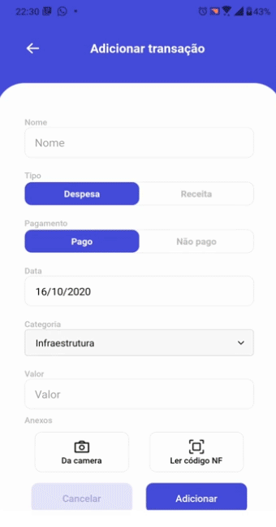

<h1 align="center">
  Financial Manager
</h1>
<h6 align = "center">
    App mobile para simplificar a gestão financeira!
    Feito para pessoas e pequenas empresas, com importação simplificada e rápida de cupom fiscal através de QR Code.
</h6>
<p align="center">
  


  <a href="https://github.com/rafaelbds04/financial-manager/commits/master">
    
  </a>
  
  <a href="https://github.com/rafaelbds04/financial-manager/issues">
    
  </a>
  
  
</p>
<div style="text-align:center; height: 70vh"></div>
</p>

# ⚡️ Principais recursos
* Gestão financeira simples
* Criação de transações rapidamente
* Importação rápida de NFC-e por QR Code
    - Preenche os dados da transação automaticamente
    - Armazena imagem da NFC-e digital
    - Evita duplicidade de lançamentos
    <div style="height: 50vh"></div>
* Permite inserção de anexos
* Controle de pagamentos e vencimentos
* Gera integridade para os dados

## 🤔 Motivações
Pessoas e pequenas empresas também fazem compras em mercados, supermercados e "vendinhas" que em suma fornecem NFC-e (Nota Fiscal de Consumidor Eletrônica) devido a sua praticidade. Porém, erps e gestores financeiros não dão suporte facilitado para importação deste tipo de nota.
Este aplicativo foi feito com objetivo de descomplicar e agilizar o controle financeiro, por meio da tecnologia e dos recursos disponíveis! *E é open-source :)
## 📱 Screenshots


## 🧐 Limitações 
* Atualmente requer conexão com a internet
* Apenas notas fiscais de consumidor cariocas (RJ) são importadas
    *Contribua para suporte a notas de outros estados!
## 🔥 Roadmap
  - [ ] Exportar dados pelo app (csv)
  - [ ] Páginas de cadastro de usuários e categorias
  - [ ] Offline First
  - [ ] Recuperação de NF-es
  - [ ] Ampliar suporte para mais estados (NFC-e)


## 🚀 Iniciando o projeto

Requerimentos: 
  * [API backend](https://github.com/rafaelbds04/financial-manager-api)
  * [Git](https://git-scm.com)
  * [Node.js](https://nodejs.org/)
  * [Yarn](https://yarnpkg.com)
    
```bash
# Clone este repositório
$ git clone https://github.com/rafaelbds04/financial-manager.git

# Vá para a pasta do repositório
$ cd financial-manager

#Instale as dependências
$ yarn

```

* Após instalado renomeie o arquivo `environment.ts.example` para `environment.ts` e defina `baseApiUrl` de acordo com o url da [API](https://github.com/rafaelbds04/financial-manager-api) e o ambiente.

```bash
# E por último execute a aplicação!
$ yarn start
```
* Expo irá executar
    * Instale o expo client no seu smartphone [iOS](https://apps.apple.com/app/apple-store/id982107779) ou [Android](https://play.google.com/store/apps/details?id=host.exp.exponent)  e conecte por meio do QR Code gerado!
    * Ou utilize um emulador 
    No Expo CLI pressione 
        * `i` para executar no Simulador iOS
        * `a` para executar no emulador Android ou dispositivo conectado
* Pronto, você já pode começar a desenvolver! 🎉

# ⭐️ Contribuindo


1. Clone este repositório e crie uma nova branch: `git checkout https://github.com/rafaelbds04/financial-manager -b <nome_da_sua_nova_branch>`.
2. Envie para branch de origem: `git push origin financial-manager / <nome_da_sua_branch>`.
3. Crie um Pull Request!

E não menos importante adicione uma [GitHub Star](https://github.com/rafaelbds04/financial-manager) para este projeto! :D

## Licença
[GNU Affero General Public License v3](https://www.gnu.org/licenses/agpl-3.0.html)